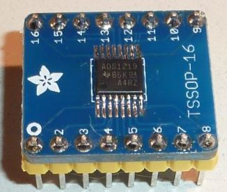

# MicroPython Driver for Texas Instruments ADS1219 Analog to Digital Converter (ADC)
The ADS1219 is a precision, 4-channel, 24-bit, analog-to-digital converter (ADC) with I2C interface
***
**Example usage: single-shot conversion**

```
from machine import Pin
from machine import I2C
from ads1219 import ADS1219
import utime

i2c = I2C(scl=Pin(26), sda=Pin(27))
adc = ADS1219(i2c)

adc.set_channel(ADS1219.CHANNEL_AIN0)
adc.set_conversion_mode(ADS1219.CM_SINGLE)
adc.set_gain(ADS1219.GAIN_1X)
adc.set_data_rate(ADS1219.DR_20_SPS)  # 20 SPS is the most accurate
adc.set_vref(ADS1219.VREF_INTERNAL)

while True:
    result = adc.read_data()
    print('result = {}, mV = {}'.format(result, 
    	result * ADS1219.VREF_INTERNAL_MV / ADS1219.POSITIVE_CODE_RANGE))
    utime.sleep(0.5)      
```

**Example usage: continuous conversion with interrupt**

```
from machine import Pin
from machine import I2C
from ads1219 import ADS1219
import utime

def isr_callback(arg):
    global irq_count
    result = adc.read_data_irq()
    print('result = {}, mV = {:.2f}'.format(
    	result, result * ADS1219.VREF_INTERNAL_MV / ADS1219.POSITIVE_CODE_RANGE))  
    irq_count += 1

i2c = I2C(scl=Pin(26), sda=Pin(27))
adc = ADS1219(i2c)
adc.set_channel(ADS1219.CHANNEL_AIN1)
adc.set_conversion_mode(ADS1219.CM_CONTINUOUS)
adc.set_gain(ADS1219.GAIN_1X)
adc.set_data_rate(ADS1219.DR_20_SPS)
adc.set_vref(ADS1219.VREF_INTERNAL)
drdy_pin = Pin(34, mode=Pin.IN)
adc.start_sync() # starts continuous sampling
irq_count = 0

# enable interrupts
print("enabling DRDY interrupt")
irq = drdy_pin.irq(trigger=Pin.IRQ_FALLING, handler=isr_callback)

# from this point onwards the ADS1219 will pull the DRDY pin
# low whenever an ADC conversion has completed.  The ESP32
# will detect this falling edge on the GPIO pin (pin 34 in this 
# example) which will cause the isr_callback() routine to run. 

# The ESP32 will continue to process interrupts and call
# isr_callback() during the following one second of sleep time.
# The ADS1219 is configured for 20 conversions every second, so
# the ISR will be called 20x during this second of sleep time.  
utime.sleep(1)
# disable interrupt by specifying handler=None
irq = drdy_pin.irq(handler=None)
print('irq_count =', irq_count)
```
***
# class ADS1219
## Constructor
```
class ads1219.ADS1219(i2c, [address = 0x040]),
```
Construct and return a new ADS1219 object with the given arguments:
  * **i2c** specifies I2C bus instance
  * **address** device address (default: 0x40)
  
Defaults after initialization:
  * channel = CHANNEL\_AIN0\_AIN1
  * gain = 1
  * data rate = 20 SPS
  * conversion mode = single-shot
  * voltage reference = internal 2.048V

## Methods
```
ADS1219.read_config()
```
Read the contents of the 8-bit Configuration Register

***  
```
ADS1219.read_status()
```
Read the contents of the 8-bit Status Register

***
```
ADS1219.set_channel(channel)
```
***
```
ADS1219.set_gain(gain)
```
***
```
ADS1219.set_data_rate(data_rate)
```
***
```
ADS1219.set_conversion_mode(conversion_mode)
```
***
```
ADS1219.set_vref(voltage_reference)
```
***
```
ADS1219.read_data()
```
Read the most recent conversion result
***
```
ADS1219.reset()
```
Resets the device to the default states
***
```
ADS1219.start_sync()
```
Starts a conversion.  start\_sync() must be called to start continuous conversion mode.  Not needed for single-shot conversion
(the read\_data() method includes a start\_sync() call for single-shot mode)
***
```
ADS1219.powerdown()
```
Places the device into power-down mode
***

## Constants

**channel(s)** being sampled

```
CHANNEL_AIN0_AIN1 
CHANNEL_AIN2_AIN3
CHANNEL_AIN1_AIN2
CHANNEL_AIN0
CHANNEL_AIN1
CHANNEL_AIN2
CHANNEL_AIN3
CHANNEL_MID_AVDD
```
***

**gain**

```
GAIN_1X, GAIN_4X
```
***

**data_rate**

```
DR_20_SPS, DR_90_SPS, DR_330_SPS, DR_1000_SPS
```
***

**conversion_mode**

```
CM_SINGLE, CM_CONTINUOUS
```
***

**voltage_reference**

```
VREF_INTERNAL, VREF_EXTERNAL
```
## Making a breakout board
The ADS1219 device is available in a TSSOP-16 package which can be soldered onto a compatible breakout board.  Here is a photo showing the device soldered into an Adafruit TSSOP-16 breakout board.



[Adafruit TSSOP-16 breakout board](https://www.adafruit.com/product/1207)

The ADS1219 device can be purchased from a supplier such as Digikey.  In single quantities each part costs around USD $6.50.  Make sure to purchase the TSSOP-16 package and not the WQFN-16 package (which is more difficult to hand solder).

[ADS1219 in TSSOP-16 package](https://www.digikey.com/product-detail/en/texas-instruments/ADS1219IPWR/296-50884-1-ND/9743261)

## How to achieve optimum performance
Using this ADC with a breakout board offers a quick way to start code development.  But, a simple breakout board does not allow the device to realize its specified performance.  Optimum ADC performance is obtained by following the manufacturer's recommended practises for layout and circuit design.  For example, bypass capacitors should be located as close as possible the analog and digital power supply pins.  Achieving a high level of performance involves creating a custom circuit board that follows best practises for mixed analog/digital designs.  
